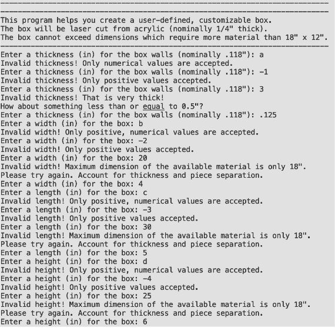
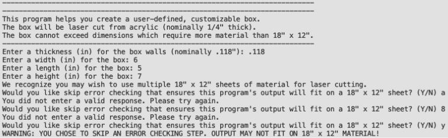
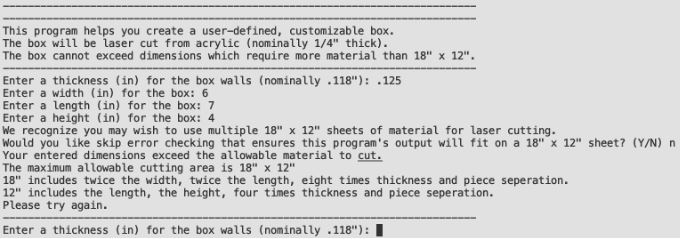
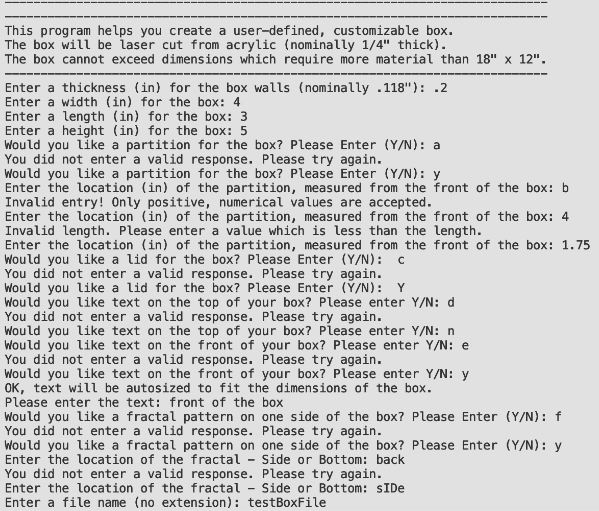
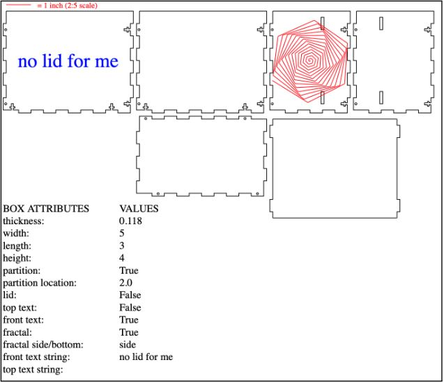
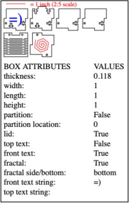
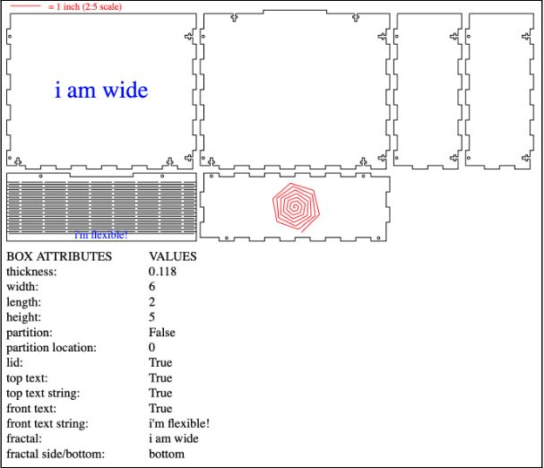
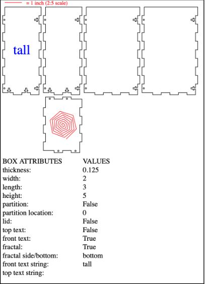

# laser_cutting

#### MECE E4606 - Digital Manufacturing
#### David D’Ambrisi & Yehuda Lehrfield
#### Spring 2022

#### The Task:
##### Familiarize yourself with software-driven fabrication by creating a program to make customizable boxes using a laser cutter. In the process, make a few boxes yourself.

## Rectangle & Initials Cut-Out
To familiarize ourselves with the laser cutter and programming for SVG creation, we initially were tasked with generating simple SVGs and successfully operating the laser cutter.

Our initial program allows the user to generate any rectangle with or without initials so long as the rectangle is not greater than two inches in length or width and the number of initials does not exceed three. The program generates SVG files of the rectangular cutouts with the text of the initials centered and autosized to not exceed the bounds of the rectangle.
Images of the generated SVG files we used for laser cutting are shown below:


Actual SVG text for the small “DJD” rectangle is shown below:
```
<?xml version = "1.0" encoding = "UTF-8" ?>
<svg xmlns="http://www.w3.org/2000/svg" version = "1.1">
<rect x = "10" y = "10" width = "48.0" height = "24.0" stroke = "black" stroke-width = "2" fill = "none" />
<text x = "34.0" y = "22.0" dominant-baseline="central" text-anchor="middle" font-size = "14.4px" fill = "red">DJD </text>
</svg>
```

Actual SVG text for the square  “YL” is shown below:
```
<?xml version = "1.0" encoding = "UTF-8" ?>
<svg xmlns="http://www.w3.org/2000/svg" version = "1.1">
<rect x = "10" y = "10" width = "192.0" height = "192.0" stroke = "black" stroke-width = "2" fill = "none" />
<text x = "106.0" y = "106.0" dominant-baseline="central" text-anchor="middle" font-size = "86.39999999999999px" fill = "red">YL </text>
</svg>
```

In our code, black signifies a complete “through” cut, and red signifies a partial, lower-power engraving (“scan” cut). In our python script, we do a pixel-to-inch calculation to simplify the process of making an SVG into an actual to-scale cutout. At the same time, we know that the actual cutout size can be changed at the laser cutter. Note that at the laser cutter, to experiment with the laser cutter software, we decided to make an additional change to the scaling of the longer DJD design resulting in the larger cutout (shown below). Lastly, note that our SVG to DXF converter changed the font (shown below).


Images of rectangles we printed using scrap wood from the Makerspace (with our initials) are shown below:


## Main Python Script Overview
In our script to generate an SVG file for cutting out a laser box, the user is prompted for several inputs to design the layout of the box and additional custom attributes. To allow for increased customizability and variety of box possibilities, we allowed for the user to define almost every variable in the process of designing the box. However, certain variables were either fixed or determined indirectly by the inputs of the user. For example, for simplicity, the size of the dovetails are fixed at 0.5” long (we initially decided to make this user dependent but opted for a fixed value in the end). Consequently, although the program accepts float inputs for the width, length and height, these inputs are cast as integers so the generated SVG does not have “disconnects” where the dovetail patterns do not meet the float dimension. Additionally, the space between pieces on the SVG layout is also fixed, as this is not a parameter that affects the design of the box.

To allow for additional possibilities in cutting various size boxes, we allowed the user to choose whether or not to be limited by the size of the material to be cut. If the user chooses to only cut on an 18”x12” piece of material (such as the acrylic given to us in class), the program ascertains that the dimensions entered by the user will fit the material. If the user chooses not to be limited by the 18”x12” dimensions, the program prints a warning to proceed with caution and does not check the user's dimensions. Lastly, unreasonable values (e.g. negative values, values greater than the longest dimension of one acrylic sheet, improper text responses) are always rejected by the program.

### User Input
To begin, the program asks the user for the thickness of the material her or she will be cutting. Illogical inputs, such as values less than zero or non-numerical inputs are rejected by the program. Additionally, unreasonable thicknesses, such as those greater than 0.5” are also rejected by the program. The user is then asked to input the width, length and height of the box to be designed. As with the thickness, illogical values (non-positive) or non-numerical values are rejected. Values that exceed the size of standard 18”x12” acrylic are also rejected. Figure 1 displays the dimension logic checks of this script.



Figure 1: Error Checking Individual Dimensions

Once the user enters dimensions, the program checks if those dimensions exceed the standard 18”x12”. If the entered dimensions exceed the allowable 18”x12”, the program asks the user if he or she would like to forgo the program’s error checking. If the user chooses to skip the program’s error checking, any dimensions for the width, length and height of the box are accepted, so long as any single dimension does not exceed 18” (standard length of acrylic stock). In this case, the program will not check if all the pieces fit on a single 18”x12” piece of material/acrylic. Figure 2 displays the warning that is issued to the user should he or she proceed without the program’s error checking.



Figure 2: Forgoing the Program’s Error Check for Total Cut Area

However, if the user chooses to use the program’s overall area dimension check and limit the box to the 18”x12” of material, the program performs an error check. If the input dimensions exceed the allowable material, the user is asked again to input the dimensions of the box. To determine if the dimensions fit the 18”x12” rectangle, the program calculated the span of the pieces to be cut out in both the width and height dimension. These simple calculations are the sum of the relative dimensions, dovetails and separation between pieces in either direction (width and height). Figure 3 shows the program's response when the user enters dimensions which exceed the available material dimensions.



Figure 3: Error Checking Dimensions with Available Cutting Material

Once acceptable dimensions are entered, the program asks the user if the box will have a partition. If anything other than “Y” or “N” (case insensitive) is entered, the program repeatedly asks the user whether or not a partition should be included. If the user decides to opt for a partition, the program asks what the location of the partition should be from the front of the box. This value can be any value up as long as it remains within the length of the box. If the user enters a value less than or equal to zero or greater than or equal to the length of the box, the program will repeatedly ask for a logical value.

The program then prompts the user to decide whether or not the box should have a lid. Again,  if anything other than “Y” or “N” (case insensitive) is entered, the program repeatedly asks the user whether or not a lid should be included. In the case of our design, the lid utilizes a kerf pattern to allow for flexibility despite only cutting in 2D. If the user decides to go ahead with a lid, the program asks whether text should be engraved on the lid. Anything other than “Y” or “N” (case insensitive) is rejected until the user decides if the lid should contain text. If the user decides text should be included, the program asks what the string of text will be and automatically sizes the font to fit within the lid of the box. The program then asks the user whether or not text should be engraved on the front of the box. The same process as above follows for this text as well.

At this stage the program asks the user whether or not a fractal should be printed on the box. Anything other than “Y” or “N” (case insensitive) is rejected until the user decides if the fractal should be printed. Finally, If the user decides to print a fractal, the program asks the user if the fractal should be printed on the side of the box or on the bottom of the box. Any entry other than “SIDE” or “BOTTOM” (case insensitive) is rejected and the user is prompted repeatedly to decide. Finally, the program asks the user to name the svg file and generates the SVG image. Figure 4 shows the program’s logic checking of the additional inputs.



Figure 4: Error Checking Additional Inputs

### Program Processes
The python script was organized in such a manner that the main() function calls upon three other functions - one to accept user input for box dimensions, a second to accept user input for box attributes (custom details) and a third to generate the SVG. The function which generates the SVG calls upon other helper functions, depending on the boolean values that result from the user input of “additional” responses/options.

The functions in the script include those to:
  1. Ask the user to input dimensions
    a. calls a function to enter single dimension
  2. Ask the user to decide box attributes (lid, partition, text, fractal, etc)
  3. Generate an SVG file (calls other helper functions)
    a. Calls helper functions
  4. Generate the main outlines of the five, six, or seven (depending on if there is a partition and/or lid) pieces of the box including dovetails, slots and holes for the screws, and, if applicable, slots and dovetails for the partition and a kerf pattern for the lid.
  5. Generate SVG text at the appropriate location
  6. Generate SVG fractal at the appropriate location

Several factors in the SVG generation and the box design are dependent on user input. For example, if the user chooses not to include a partition, no slots will be cut out of the side walls, and no partition piece will be cut. Similarly, if the user chooses not to include a lid, the top of all five sides (front, back, right and left) are cut flat, whereas, if the user opts for a lid, large dovetails are cut to extend from the back to allow the lid to fit nicely. Additionally, the cut outs for screw and nut slots in the back piece of the box is dependent on whether the user decides to include a lid. (See Figures 4 -7).

### Box Design
The design of our box is such that one function can print out every piece with slight variations. The pieces were designed such that one simple base pattern can be used for the four sides and bottom so that the four sides can wrap around and fit snugly together and into the bottom piece with a dovetail pattern. The extension of the dovetails equals the thickness of the material cut to create smooth, clean edges.

To create this dovetail pattern, for loops were utilized based on the five points of a single dovetail extending and returning to the base dimension. The for loop iterates over the range of the relative dimension (width, height or length). When one particular edge of a piece does not include dovetails, the program skips the for loop and draws a straight line (in the case of the sides and front and the back as well, if no lid is included). If a lid is included, the standard for loop is skipped and instead a larger dovetail pattern is created for the lid to back-piece connection. In all instances, the SVG polyline command was used to generate the image for the piece outline.

Because the pieces wrap around in one direction, one block of code was used to create slots for the screws on the right vertical side of each piece, aside for the bottom. The SVG polyline command was used to create these patterns. Similarly, one block of code was used to create all holes (SVG circle command) on the left vertical side of each piece, aside for the bottom. The bottom was connected to the front and back pieces with screws; the same blocks of code used for the sides were slightly modified and used for these locations as well.

The (optional) partition is a simple cut with two 0.5” dovetails on either side of the partition, located 0.25” from the bottom and top of the box. The partition is generated using the SVG polyline command. No screws are needed for the partition connection, as the entire box is secured already with screws on each of the sides and through the bottom.

The (optional) fractal was generated by simple mathematical equations, such that a line starts at the center of the piece (bottom or side) and changes direction by 59 degrees each iteration along with an increase in line length. The fractal pattern was limited to the size of the piece, based on the smaller of the horizontal and vertical dimensions.

To make the lid a functional lid, we decided to use a kerfing technique to make a “living hinge”. Initially, we experimented with our own concepts, all of which were not very flexible. After watching a video showing the failure points for various common kerf patterns, we decided to base our new design (what would become our final design) on the pattern that made the wood most flexible according to the video.

The pattern featured straight cuts that left small remaining gaps of material. In the video, one line of cuts was followed by another line of cuts of different length. In our final design, we simplified the pattern by making every other line have completely cut out wood except for small bits of material at each edge. To generate a kerf pattern that would be applicable to every box, we calculate the total number of widthwise columns that can be incorporated by dividing the width by the length of each cut and two times the size of the remaining wood pieces (wood material between the cuts). To get the number of columns, we round down by taking in the integer of the calculation. Next, we create end cuts that fill in the remaining cut space that is too small for a full line length. This is done by taking into account the width of the box, the space occupied by the number of columns and gaps, and also this is done by recognizing there will be one more wood gap than slit. After this is done, nested for loops are used to populate the lid with the kerf pattern. The first for loop iterates the slits-gap pattern across the width of the box. The second for loop, iterates the pattern downward. At the beginning and end, special polylines generate the smaller slits that are used because a full-length line cannot fit without going beyond the width of the box.

### SVG Images
Figures 5 - 8 are typical of what our python program generates. The text below the cut out pattern was generated by the script as SVG text. All four SVG images shown below were limited to the 18”x12” dimensions and subject to the program's error checks so as to not exceed the allowable dimensions.



Figure 5: SVG image of a laser-cut box layout with a partition but no lid



Figure 6: SVG image of a very small laser-cut box layout with a lid but no partition



Figure 7: SVG image of a laser-cut box layout with a lid but no partition



Figure 8: SVG image of a laser-cut box layout with no lid or partition

### Assembled Boxes
Here are a couple images of assembled boxes!


